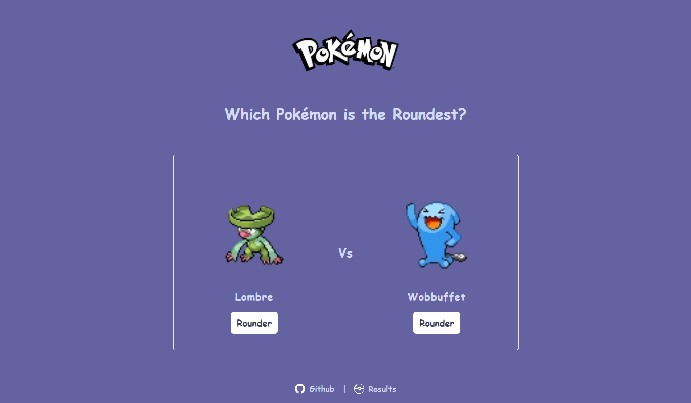
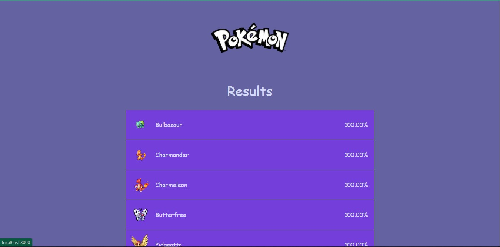

# Roundest-poki

A silly two page game to answer the ultimate question, what is the roundest Pokémon

## Demo

https://roundest-poki.vercel.app/

## Screenshots




## Acknowledgements

- [Thanks to Theo Browne](https://github.com/TheoBr)

## Tech Stack

**React, Nextjs, Typescript, Trpc, Prisma, TailwindCSS**

**DB:** Cloud PostgreSQL on Heroku

## Run Locally

Clone the project

```bash
  git clone https://github.com/alireza-constantin/roundest-poki
```

Go to the project directory

```bash
  cd roundest-poki
```

Install dependencies

```bash
  npm install
```

## Create .env file

you need to create two postgres database locally or cloud
because Some development-focused commands for relational databases of Prisma Migrate use a second, temporary database
[link to docs on prisma](https://www.prisma.io/docs/concepts/components/prisma-migrate/shadow-database)

then enter your database url to these variable in .env file

```code
    DATABASE_URL=
    SHADOW_DATABASE_URL=
```

Start the development server

```bash
  npm run dev
```

## Deploy on Vercel

The easiest way to deploy your Next.js app is to use the [Vercel Platform](https://vercel.com/new?utm_medium=default-template&filter=next.js&utm_source=create-next-app&utm_campaign=create-next-app-readme) from the creators of Next.js.

Check out our [Next.js deployment documentation](https://nextjs.org/docs/deployment) for more details.
